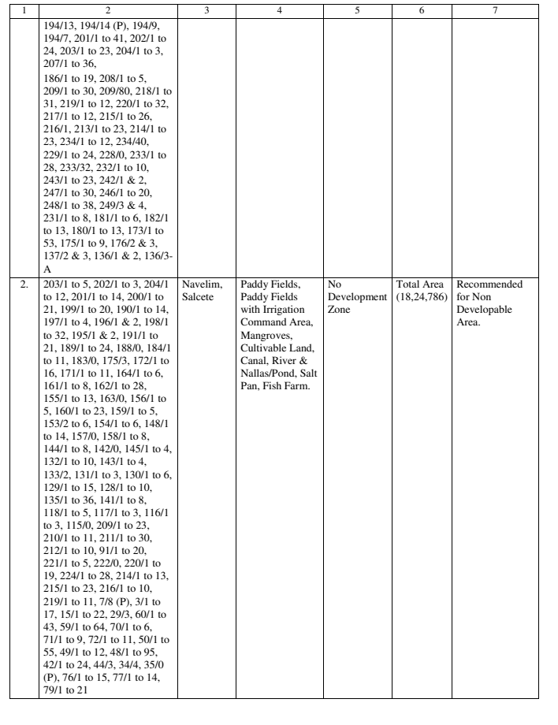
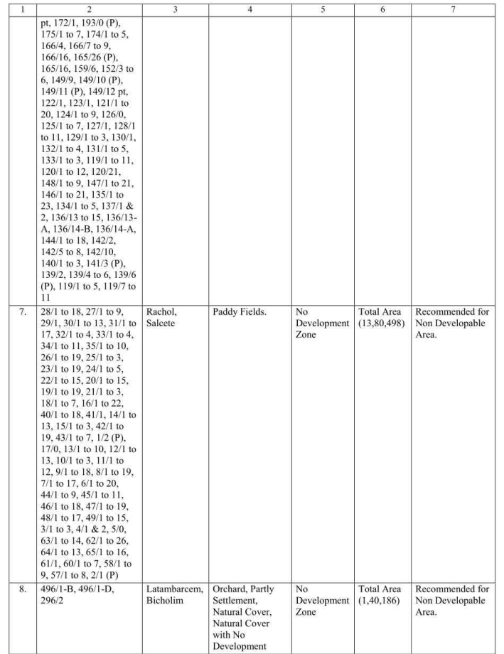

# How 39A table extraction works

Gazette scans are messy. Tables run across pages, OCR drops serial numbers, and Docling
sometimes squashes columns together or cuts rows in the wrong place. This doc explains, step
by step, how Bakasur turns those tables into records, how it repairs the common problems,
and when it holds a record back for a human instead of guessing.

The examples come from the two fixtures in [`fixtures/`](../fixtures/):

- **OG19**: Series III No. 19, 6th Aug 2026 (scanned; NDZ + change-of-zone + corrigendum)
- **OG21**: Series III No. 21, 20th Aug 2026 (NDZ + change-of-zone)

## The journey of a gazette

```
PDF ─► 1. parse ─► 2. find 39A sections ─► 3. stitch tables ─► 4. map columns
                                                                     │
        6. validate ◄─ build records ◄─ 5. merge continuation rows ◄─┘
          │
          ├─► main sheet + plots   (good records)
          └─► review_queue + email (records that need a human)
```

1. **Parse.** Docling turns each page into text and tables (`data/gazettes/{id}/tables/*.json`).
2. **Find 39A sections.** Phrases like "Section 39A" and "No Development Zone" mark where each
   notification starts and ends ([`gazette/anchors.py`](../src/bakasur/gazette/anchors.py)).
3. **Stitch tables.** A table that runs over several pages is joined back into one.
4. **Map columns.** Work out which column is the Sr. No., the survey numbers, the village, etc.
5. **Merge continuation rows.** Text that spilled onto the next page is joined back onto its record.
6. **Validate.** Good records go to the main sheet and are expanded into plots. Doubtful ones
   go to the review queue.

Steps 3–6 are covered below. The orchestration lives in
[`extract.py`](../src/bakasur/extract.py).

## Step 3: Stitching tables across pages

Code: [`chain_tables` / `stitch_tables`](../src/bakasur/gazette/tables.py#L207)

Two tables on consecutive pages are joined when they look like one table:

- they have the same number of columns,
- there's no body text between them, and
- the Sr. Nos. don't restart.

### When Docling squashes the Sr. No. column into the survey column

On some pages Docling merges column 1 (Sr. No.) into column 2 (survey numbers). That page then
has one column too few, so it would not be joined. Its records would end up in a small
headerless table that no mapper accepts, and they'd be lost without warning.

**How it's spotted:** gazette tables have a row of column numbers under the header. Normally
it reads `1 | 2 | 3 | …`. On a squashed page it reads `1 2 | 3 | 4 …` or `2 | 3 | 4 …`.
That row tells us column 1 was swallowed ([`_folds_first_column`](../src/bakasur/gazette/tables.py#L133)).

**How it's repaired:** [`_unmerge_first_column`](../src/bakasur/gazette/tables.py#L141) splits
the Sr. No. back out of the survey cell and restores the column count, so the page joins
the table. There are two cases.

#### Case 1: the Sr. No. is in the middle of the cell (exact repair)

OG21 page 3. Row 1 (Guirdolim) started on page 2 and spills over; row 2 (Navelim) starts here:



Docling returned both rows as a single row, with everything in one cell:

```
"194/13, … 136/3- A  2.  203/1 to 5, … 79/1 to 21"  | Navelim, Salcete | …
 └── Guirdolim's overflow ─┘     └── Navelim's own survey list ──┘
```

The `2.` in the middle marks exactly where one record ends, so the row is split there:

```
[ ""   | "194/13, … 136/3- A"      | ""               | … ]   ← overflow; joins record 1 in step 5
[ "2." | "203/1 to 5, … 79/1 to 21" | Navelim, Salcete | … ]   ← record 2
```

The result matches the PDF exactly, so nothing is flagged.

#### Case 2: the Sr. No. starts the cell (repaired, then flagged for review)

OG19 page 5. The first row is the overflow of record 6 (Raia); records 7 and 8 follow:



Here Docling made a second mistake: it cut the survey text in the wrong places.

| Docling's row | What its survey cell actually contains | Village |
|---|---|---|
| `7.` | Raia's overflow + **first half** of Rachol's list | Rachol |
| `8.` | **Second half** of Rachol's list + Latambarcem's list | Latambarcem |

The other columns (village, land use, area, decision) are correct. Splitting off `7.` and `8.`
restores the columns and recovers both records. But nothing in the text marks where Raia's
overflow ends or where Rachol's list was cut; only the page layout shows it. So these records
are marked **suspect**:

- every record whose Sr. No. started a merged cell (7 and 8), and
- the record before them (6, Raia), whose overflow was swallowed.

Suspect Sr. Nos. are carried on `StitchedTable.suspect_sr` and become a review reason in step 6.

## Step 4: Mapping columns

Code: [`llm/schema_mapper.py`](../src/bakasur/llm/schema_mapper.py)

Mapping means deciding which column holds which field, for example:

```
sr_no=0, survey=1, village_taluka=2, existing_use=3, proposed_use=4, area_proposed=5, decision=6
```

There are two mappers, which share the `ColumnMapper` interface in
[`llm/base.py`](../src/bakasur/llm/base.py):

- **Heuristic** ([`heuristic_map_columns`](../src/bakasur/llm/schema_mapper.py#L71)): matches header
  words against `HEADER_ALIASES` ("Sy. No." means survey, "Decision" means decision). If the
  headers are blank but the table has the standard 7 (NDZ) or 8 (change-of-zone) columns, it
  assumes the standard order.
- **LLM** (`OllamaMapper` for a local model such as Qwen, or `OpenAICompatMapper`).

### The heuristic goes first

With `LLM_PROVIDER=ollama` or `openai_compat`, `get_mapper` returns a
[`HeuristicFirstMapper`](../src/bakasur/llm/schema_mapper.py#L285). It uses the heuristic's
answer whenever the heuristic finds a map, and only asks the LLM about tables the heuristic
can't map. The LLM can therefore add tables, but never override a table the heuristic handles.

This matters because a small local model can give a confident wrong answer that passes basic
validation. In testing, `qwen2.5:7b` once returned this for OG19's change-of-zone table:

| Field | Correct | Qwen |
|---|---|---|
| `existing_use` | 4 | None |
| `proposed_use` | 5 | 4 |
| `area_proposed` | 6 | 5 |
| `decision` | 7 | 6 |

Every field after the missing one is shifted one column left, so area values would land in Decision.

### How the LLM is asked

- **Both variants count.** The prompt states that NDZ and change-of-zone tables are both 39A
  tables. An earlier wording ("is this a change-of-zone table?") made the model reject every
  NDZ table.
- **Columns come with their numbers.** The table is sent column by column, so the model reads
  each column's number instead of counting positions:
  ```json
  {"index": 6, "header": "Decision of the TCP Board", "samples": ["Recommended for Non Developable Area."]}
  ```
- **Temperature 0** (Ollama), so the same table always gets the same answer.

### Sanity checks on the LLM's answer

[`_check_sample_content`](../src/bakasur/llm/schema_mapper.py#L232) rejects a map whose columns
hold the wrong kind of value:

- **Decision:** if a sample row contains "Recommend…", it must be in the column the map calls
  `decision`. A decision such as "Deferred." is still allowed.
- **Area:** at least one sample in the `area_proposed` column must contain a number with 2 or
  more digits. Only one is needed, because OCR sometimes moves a row's area into the next cell.
  Two digits stop zone codes like "Residential (S1)" from passing as an area.

The shifted map above fails the decision check: its decision column holds `319`, while
"Recommended…" is in the next column. When a map is rejected, the mapper falls back to the
heuristic and logs `… column mapping failed, using heuristic`.

## Step 5: Merging continuation rows

Code: [`merge_continuation_rows`](../src/bakasur/gazette/tables.py#L296)

A row with a blank Sr. No. is one of two things:

- **(a)** the overflow of the record above, spilled onto the next page, or
- **(b)** a real new record whose Sr. No. OCR dropped.

Two rules decide which.

**Rule 1, content** ([`_is_continuation_row`](../src/bakasur/gazette/tables.py#L265)): if the
blank row has its own survey numbers *and* its own village, it's a new record. Otherwise it's
overflow.

**Rule 2, the Sr. No. sequence** ([`_sequence_verdicts`](../src/bakasur/gazette/tables.py#L276)):
look at the numbered rows above and below.

```
5. | Rahul Sayal …
   | (blank row)        5 then 6: no room for another record → overflow of 5
6. | Augustino Ferrao …
```

```
8.  | …
    | 206/1 | Curchirem  8 then 10: one missing number, one blank row → record 9
10. | …
```

Rule 2 only decides when the numbering is conclusive:

- the next number is N+1, so every blank row in between is overflow, or
- the gap matches the number of blank rows, so each blank row is a new record.

It decides nothing when:

- there is no numbered row above (OG19's change-of-zone rows 1–4 lost their Sr. Nos.),
- a Sr. No. is unreadable (OG19's first NDZ row reads `-`),
- the numbering goes backwards, or
- the gap doesn't match the number of blank rows.

In those cases rule 1 decides.

**When the two rules disagree,** rule 2 wins, because numbering is firmer evidence than a guess
about content, and the records involved are flagged:

- If the row was merged into the record above, that record is flagged.
- If the row was split off as a new record, both it and the record above are flagged.

For example, a village name that wraps across a page break ("Parra," then "Bardez") looks like
a new record to rule 1. Rule 2 sees 5 followed by 6 and merges it into "Parra, Bardez", but the
record goes to review.

`merge_continuation_rows` returns `(rows, disputed)`, where `disputed` holds the indices of the
flagged records.

## Step 6: Validation and the review queue

Code: [`extract.py`](../src/bakasur/extract.py#L22), [`validate.py`](../src/bakasur/validate.py#L37)

Each record (`ApplicationRow`) has a `review_reason`. Extraction sets it when:

| Reason | When |
|---|---|
| `MIXED_SURVEY_REASON` | The record's Sr. No. is suspect after a squashed-column repair (step 3, case 2) |
| `DISPUTED_SPLIT_REASON` | The two merge rules disagreed about this record (step 5) |

A record can carry both. Validation turns `review_reason` into a blocking issue
(severity `error`), so in [`pipeline.py`](../src/bakasur/pipeline.py#L117) the record:

- stays out of the main sheet,
- is not expanded into plots (plots come only from records that pass validation), and
- appears in the `review_queue` tab and the email digest, with the reason.

Doubtful data doesn't slip into the main sheet, and records aren't silently dropped either.
`review_reason` is not one of the sheet columns (`ApplicationRow.to_dict`), so the main sheet
layout is unchanged.

## Results on the fixtures

| | Before these rules | Now |
|---|---|---|
| OG21 | 24 records; Navelim missing | 25 records, all to the main sheet |
| OG19 | 31 records; Rachol and Latambarcem missing, Raia's survey list incomplete | 33 records: 30 to the main sheet, 3 (Raia, Rachol, Latambarcem) to review |
| `LLM_PROVIDER=ollama` (`qwen2.5:7b`) | Dropped every NDZ table; one shifted map | Same records as the heuristic alone |

## Using a local LLM

The heuristic handles every 39A table in both fixtures, so the LLM is optional. To use a local
model:

```bash
brew install ollama
brew services start ollama
ollama pull qwen2.5:7b
```

Then set this in `.env`:

```env
LLM_PROVIDER=ollama
LLM_MODEL=qwen2.5:7b
```

A 7B model at 4-bit takes about 5 GB of memory and roughly 5–10 s per table on an M1 Pro. The
default `llama3.2` (3B) is smaller and more likely to return wrong column numbers.

## Known gaps

- **NDZ areas aren't parsed.** Values like "Total Area (11,22,919)", which use Indian digit
  grouping, leave `total_area_sqm` empty.
- **Log noise.** The LLM logs a fallback warning for non-39A tables inside a 39A section, such
  as OG19's road-signboard tables. Those tables are still rejected correctly.
- **Suspect rows need a human.** Rows flagged in step 3, case 2 can't be fixed from the text.
  Someone has to correct their survey numbers against the PDF.
